[linkedin](https://www.linkedin.com/in/gaurinagre/) &nbsp;·&nbsp;
[instagram](https://www.instagram.com/gauri._exe/) &nbsp;·&nbsp;
[email](mailto:gaurinagre13@gmail.com)

> Program Analyst · ex-Senior Consultant in Business & Data Analytics. 
> Turning raw data into decisions that actually move the business.

I build analytics end-to-end — from SQL and dashboards through A/B testing 
to the "so what?" that actually changes a decision. Right now that's my 
[Hospital Analytics Project](https://github.com/GauriNagre/Hospital-Analytics), 
targeting patient readmissions, wait times, and staff-utilization gaps. 
Currently sharpening advanced SQL, Python for analytics, and modern BI tooling.

<samp>sql &nbsp; python &nbsp; java &nbsp; typescript &nbsp; dashboards &nbsp; a/b testing &nbsp; machine learning</samp>

**[Hospital Analytics Project](https://github.com/GauriNagre/Hospital-Analytics)** &nbsp;·&nbsp; <samp>sql, dashboards</samp> 
End-to-end reduction of hospital readmissions and wait times, with a 
staff-utilization view that flags gaps across departments.

**[Portfolio-Website](https://github.com/GauriNagre/Portfolio-Website)** &nbsp;·&nbsp; <samp>html, css, javascript</samp> 
A working analytics showcase: SQL work, dashboards, A/B tests, and the 
business insights each of them produced.

**[EZYML](https://github.com/GauriNagre/EZYML)** &nbsp;·&nbsp; <samp>python, ml</samp> 
Making machine-learning workflows simpler — less boilerplate, faster path 
from raw data to trained model.

Every graphic here is generated, not embedded from anyone else's server. 
`ascii.svg` is a photo pushed through a character ramp by 
[`scripts/make_portrait.py`](scripts/make_portrait.py); the stat graphics and 
these section headings are drawn by [a scheduled action](.github/workflows/stats.yml) 
straight from the GitHub GraphQL API, once a day, committing only what changed.

They animate with SMIL inside the SVG, because GitHub strips scripts from 
READMEs — and since nothing loads from a third party, nothing here can 
rate-limit or go dark. The headings are SVGs for the same reason: GitHub also 
strips CSS, so an image is the only way to put this page's own typeface on them.

Language totals cover public repositories only. `year.svg` uses the portrait's 
character ramp: `:` `+` `#` `@`, quiet to loud.

Setup adapted from [andriidrok1/andriidrok1](https://github.com/andriidrok1/andriidrok1).
